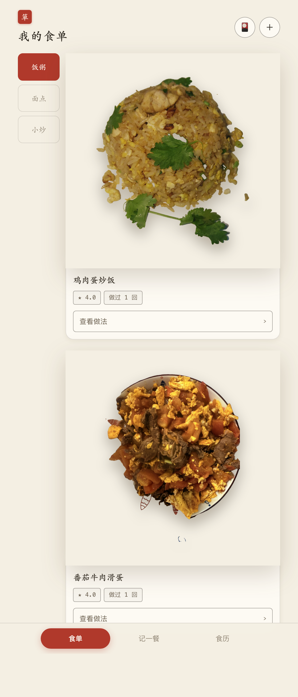
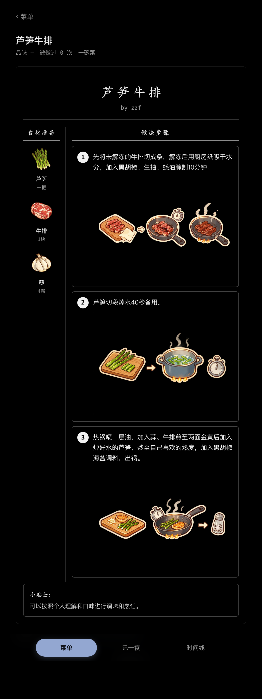
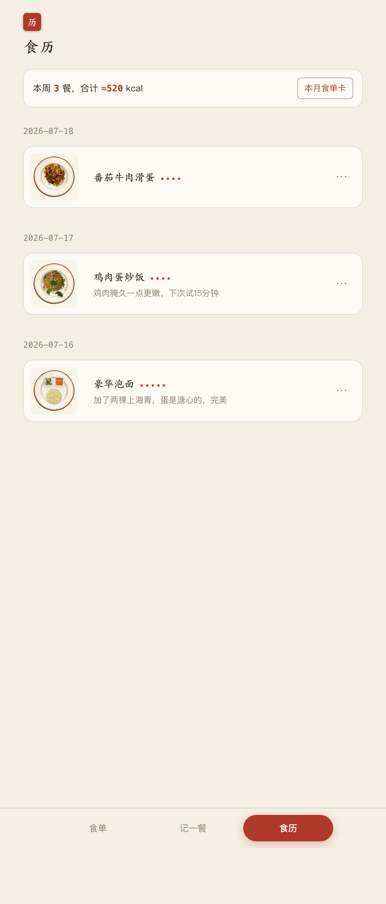

# 一箪食 yidanshi

> 一箪食，一瓢饮，在陋巷……不改其乐。——《论语·雍也》

记录自己做的每一顿饭，沉淀成一份好看的个人食单。

你是不是也这样：每周做饭，做法都是现找教程，做完就忘了怎么做的？
一箪食帮你把「做过的饭」变成资产。

| 今天吃什么 | 做法教程卡 | 吃饭时间线 |
|---|---|---|
|  |  |  |

## 功能

- 📷 **拍照即记录** — 拍完用圆框参考线把盘子框准，本地 [rembg](https://github.com/danielgatis/rembg) AI 抠图和「圆框直裁」两种效果各出一张任选（3–4 秒，不花钱不上传云端）；iPhone 长按抠好的透明图直接传，自动识别
- 📖 **自己的菜单** — 一碗饭 / 一碗面 / 一碗汤 / 一碗菜分类浏览，每道菜有品味评分、做过几次；🎲 在当前分类里「随便来一份」；记录可改可删
- 🎨 **一键插画教程卡** — 印刷菜谱卡质感：楷体菜名、食材图标、编号步骤、小贴士。配好生图 API 后详情页一键为整道菜生成「贴纸式厚涂卡通」插画（食材图标 + 分步骤道具拼贴图，逐张进度、边画边显示）；风格规范与 prompt 模板见 [docs/illustration-style.md](docs/illustration-style.md)，手动出图走 `scripts/gen_illust_prompts.py`
- 🤖 **AI 整理教程** — 教程文案、甚至你自己随口描述的一段做法，粘进 App 即整理成结构化菜谱。文字与生图通道均可配置（示例见 [deploy/config.example.json](deploy/config.example.json)）：文字走本机 `claude` / `codex` CLI（零配置复用订阅）或 OpenAI 兼容 API（DeepSeek 等，注意 DeepSeek 无多模态）；生图走任意 OpenAI 兼容 `/images/generations`（豆包 Seedream、gpt-image-1、SiliconFlow 等）。菜谱本身是 `data/recipes/*.md`，让 AI 助手直接写文件也行（[docs/recipe-ingest.md](docs/recipe-ingest.md)）
- 🏠 **自托管** — 跑在自己电脑上，手机浏览器加到主屏当 App 用（PWA，支持长按图标直达「记一餐」）

## 快速开始

```bash
git clone https://github.com/Chasingwind-Z/yidanshi && cd yidanshi

# 后端（Python 3.10+）
python3 -m venv .venv && .venv/bin/pip install -r server/requirements.txt

# 前端（Node 18+）
cd web && npm install && cd ..

# 跑起来（首次会自动下载抠图模型 ~180MB）
./scripts/serve.sh          # http://localhost:18100
```

macOS 想常驻后台：`./scripts/manage.sh install`（launchd 开机自启，`status` / `log` / `backup` / `uninstall` 子命令齐全）。手机在同一 Wi-Fi 下访问 `http://<电脑IP>:18100`，浏览器「添加到主屏幕」即可。

开发模式：`./scripts/dev.sh`（后端 :18100 + 前端热更新 :5173）。

### 暴露到公网？先设访问口令

同一 Wi-Fi 局域网自用默认不设防（手机打开即用）。若要把服务开到公网（内网穿透 / 端口转发），
在 `data/secrets.env` 加一行 `YIDANSHI_TOKEN=一串随机字符` 再重启：主人接口（菜谱/记录/设置/备份等）
就都要口令了，访客点菜链接（另有 guest token）和封面图不受影响。手机端用一次魔法链接
`http://<电脑IP>:18100/#/?token=你的令牌` 打开即可，令牌存本地、自动从地址栏抹掉。
（用 `#/` 开头的哈希形式，令牌不会随请求发到服务器、不进访问日志；curl 也可用 `?token=`／`X-Token` 头。）

## 数据即文件

```
data/
├── recipes/lusun-niupai.md   # 一道菜 = 一个 Markdown（frontmatter + 食材/步骤/贴士）
├── meals.json                # 吃饭记录
└── photos/                   # 原图 / 抠图 / 菜卡 / 插画
```

没有数据库。备份 = 打包 data/（`./scripts/manage.sh backup`）；迁移 = 拷目录；批量编辑 = 让 AI 助手直接改文件。示例菜谱见 [examples/recipes](examples/recipes)。

抠图默认 `isnet-general-use` 模型，追求更高质量：`YIDANSHI_MODEL=birefnet-general`（~930MB）。

## 命名典故

整个产品是一套「私人食单手账」的叙事——你是这份食单的主人：

| 名字 | 出处 |
|---|---|
| **一箪食** | 《论语·雍也》「一箪食，一瓢饮，在陋巷……不改其乐」——一个人也要把简单饭菜吃出快乐 |
| **食单** | 致敬袁枚《随园食单》，中文世界最有名的私人菜谱集；分类「饭粥/面点/羹汤/小炒/甜点」也是随园章法 |
| **朱批** | 古时皇帝用朱砂红笔在奏折上批示、文人用朱笔在书边写心得。这里：菜谱正文是墨字，你每次做完记下的经验（"腌15分钟更嫩"）化作教程卡上的红批注，越做越厚 |
| **翻牌子** | 宫廷选膳梗——今天吃什么，翻一张牌决定（可以约束：7 天不重样、30 分钟内、只要简单的、优先用冰箱食材） |
| **传旨** | 把点菜链接发给亲友，对方勾好菜「传旨」，圣旨送达你的御膳房（食单页收件箱） |
| **食历** | 吃饭的日历——你做过的每一顿，按日排开，周有小结，月有食单卡 |

## 灵感

来自微信小程序「我的Taste」（by 抖音博主 AB）——它展示的是作者自己的菜谱，而一箪食让每个人都能拥有自己的版本。微信小程序版移植评估见 [docs/miniprogram-eval.md](docs/miniprogram-eval.md)。

## License

[MIT](LICENSE)
